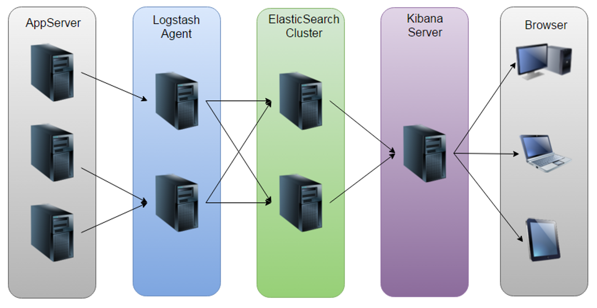
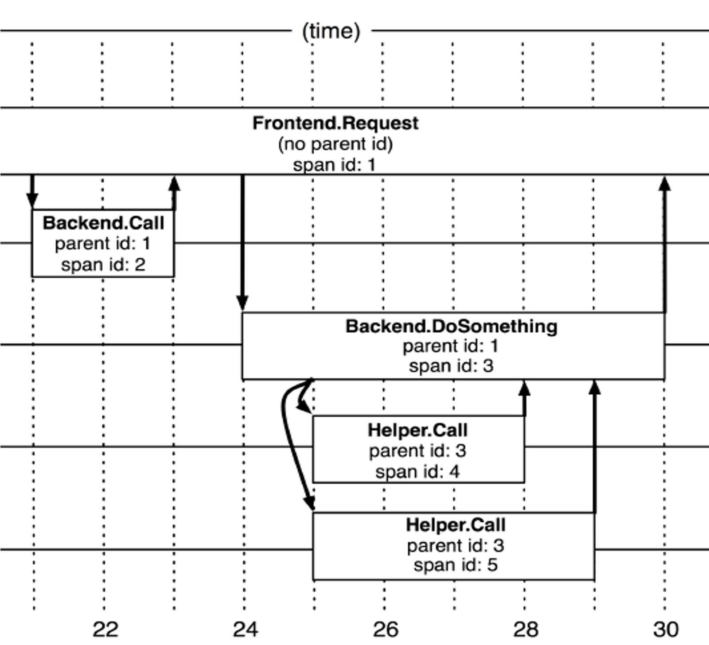

# 服务治理

## 概览

- 日志
- 链路追踪
- 指标

## 日志

### 日志级别

- Trace / Debug / Notice / Info
- Warn
- Error
- Fatal 

Fatal

记录消息后，直接调用 os.Exit(1)，这意味着：

- 在其他 goroutine defer 语句不会被执行；
- 各种 buffers 不会被 flush，包括日志的；
- 临时文件或者目录不会被移除；

Warn

没人看警告，因为从定义上讲，没有什么出错。也许将来会出问题，但这听起来像是别人的问题。

### 日志选型

一个完整的集中式日志系统，需要包含以下几个主要特点：

- 收集－能够采集多种来源的日志数据；
- 传输－能够稳定的把日志数据传输到中央系统；
- 存储－如何存储日志数据；
- 分析－可以支持 UI 分析；
- 警告－能够提供错误报告，监控机制；

大概的链路是 

应用实例写日志 -> 物理机agent -> mq（避免gateway流量太大） -> logstash（数据格式转换）-> elasticSearch

由于 Error 和 Warn 的日志价值比较大，单独搞集群和其他类型日志隔离开。

## 链路追踪

目标
- 无处不在的部署
- 持续的监控
- 低消耗
- 应用级的透明
- 延展性
- 低延迟

- TraceID
- SpanID
- ParentID
- Family & Title

固定采样，1/1024
    
    这个简单的方案是对我们的高吞吐量的线上服务来说是非常有用，因为那些感兴趣的事件(在大吞吐量的情况下)仍然很有可能经常出现，并且通常足以被捕捉到。然而，在较低的采样率和较低的传输负载下可能会导致错过重要事件，而想用较高的采样率就需要能接受的性能损耗。对于这样的系统的解决方案就是覆盖默认的采样率，这需要手动干预的，这种情况是我们试图避免在 Dapper 中出现的。

应对积极采样

    我们理解为单位时间期望采集样本的条目，在高 QPS 下，采样率自然下降，在低 QPS 下，采样率自然增加；比如1s内某个接口采集1条。

## 指标

涉及到 net、cache、db、rpc 等资源类型的基础库，首先监控维度4个黄金指标：

- 延迟（耗时，需要区分正常还是异常）
- 流量（需要覆盖来源，即：caller）
- 错误（覆盖错误码或者 HTTP Status Code）
- 饱和度（服务容量有多“满”）

系统层面：

- CPU，Memory，IO，Network，TCP/IP 状态等，FD（等其他），Kernel：Context Switch
- Runtime：各类 GC、Mem 内部状态等

线上打开 Profiling 的端口

- 使用服务发现找到节点信息，以及提供快捷的方式快速可以 WEB 化查看进程的 Profiling 信息（火焰图等）；
- watchdog，使用内存、CPU 等信号量触发自动采集；

## 引用

https://dave.cheney.net/2015/11/05/lets-talk-about-logging
https://www.ardanlabs.com/blog/2013/11/using-log-package-in-go.html
https://www.ardanlabs.com/blog/2017/05/design-philosophy-on-logging.html
https://dave.cheney.net/2017/01/23/the-package-level-logger-anti-pattern
https://help.aliyun.com/document_detail/28979.html?spm=a2c4g.11186623.2.10.3b0a729amtsBZe
https://developer.aliyun.com/article/703229
https://developer.aliyun.com/article/204554
https://developer.aliyun.com/article/251629
https://www.elastic.co/cn/what-is/elk-stack
https://my.oschina.net/itblog/blog/547250
https://www.cnblogs.com/aresxin/p/8035137.html
https://www.elastic.co/cn/products/beats/filebeat
https://www.elastic.co/guide/en/beats/filebeat/5.6/index.html
https://www.elastic.co/cn/products/logstash
https://www.elastic.co/guide/en/logstash/5.6/index.html
https://www.elastic.co/cn/products/kibana
https://www.elastic.co/guide/en/kibana/5.5/index.html
https://www.elastic.co/guide/en/elasticsearch/reference/5.6/index.html
https://elasticsearch.cn/
https://blog.aliasmee.com/post/graylog-log-system-architecture/
